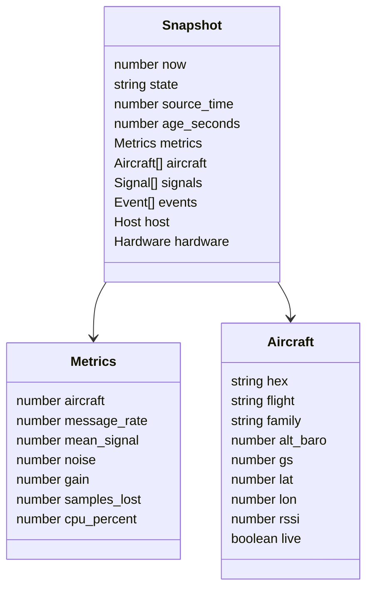

# API reference

The browser uses same-origin HTTP endpoints. Read endpoints are public and require no session cookie. They support the dashboard rather than a versioned third-party API, so consumers should expect response shapes to evolve with the application.

## Routes

| Method | Path                   | Access                        | Purpose                                                             |
| ------ | ---------------------- | ----------------------------- | ------------------------------------------------------------------- |
| GET    | `/login`               | Public                        | Redirect legacy bookmarks to `/`                                    |
| GET    | `/api/snapshot`        | Public                        | Latest aircraft, signals, metrics, events, host, and hardware state |
| GET    | `/api/history?hours=1` | Public                        | One to 168 hours of downsampled stored measurements                 |
| GET    | `/api/logs`            | Public                        | Bounded decoder log tail                                            |
| GET    | `/api/export`          | Public                        | Aircraft snapshot as CSV                                            |
| GET    | `/api/health`          | Public                        | Application health and collector start time                         |
| POST   | `/api/settings`        | Local loopback + local origin | Validate and update station name and coordinates                    |
| GET    | `/api/uplink`          | Local loopback bearer token   | Snapshot envelope for the Mac uploader                              |
| POST   | `/api/ingest`          | Relay bearer token            | Accept a validated Mac telemetry envelope                           |

## Snapshot state

Unknown values are represented as JSON `null` or absent source fields. Consumers must not interpret a missing measurement as zero.

## Error behavior

| Status | Meaning                                                    |
| -----: | ---------------------------------------------------------- |
|    303 | Legacy `/login` redirect back to the application           |
|    400 | Invalid request size, shape, range, or encoding            |
|    401 | Missing or invalid relay token                             |
|    403 | Invalid hostname/origin/path or remote-only setting change |
|    404 | Unknown endpoint or unavailable static asset               |
