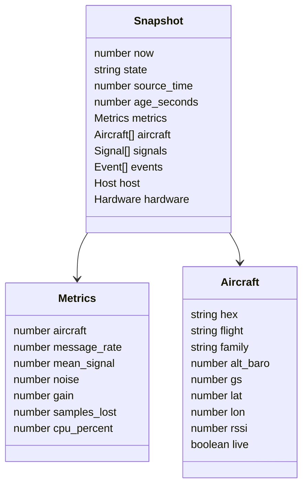

# API reference

The browser uses same-origin HTTP endpoints. All responses that contain telemetry require the application session cookie. There is no supported third-party public API.

## Routes

| Method | Path                   | Access                         | Purpose                                                             |
| ------ | ---------------------- | ------------------------------ | ------------------------------------------------------------------- |
| GET    | `/login`               | Anonymous                      | Render the sign-in form                                             |
| POST   | `/auth/login`          | Anonymous with matching origin | Validate the owner account and create a session                     |
| POST   | `/auth/logout`         | Session with matching origin   | Revoke the current session                                          |
| GET    | `/api/snapshot`        | Session                        | Latest aircraft, signals, metrics, events, host, and hardware state |
| GET    | `/api/history?hours=1` | Session                        | One to 168 hours of downsampled stored measurements                 |
| GET    | `/api/logs`            | Session                        | Bounded decoder log tail                                            |
| GET    | `/api/export`          | Session                        | Aircraft snapshot as protected CSV                                  |
| GET    | `/api/health`          | Session                        | Application health and collector start time                         |
| POST   | `/api/settings`        | Local loopback session         | Validate and update station name and coordinates                    |
| GET    | `/api/uplink`          | Local loopback bearer token    | Snapshot envelope for the Mac uploader                              |
| POST   | `/api/ingest`          | Relay bearer token             | Accept a validated Mac telemetry envelope                           |

## Snapshot state

Unknown values are represented as JSON `null` or absent source fields. Consumers must not interpret a missing measurement as zero.

## Error behavior

| Status | Meaning                                                    |
| -----: | ---------------------------------------------------------- |
|    303 | Browser redirect to login or back to the application       |
|    400 | Invalid request size, shape, range, or encoding            |
|    401 | Missing or invalid dashboard session or relay token        |
|    403 | Invalid hostname/origin/path or remote-only setting change |
|    404 | Unknown endpoint or unavailable static asset               |
|    429 | Login rate limit reached                                   |
|    503 | Required account configuration is unavailable              |
