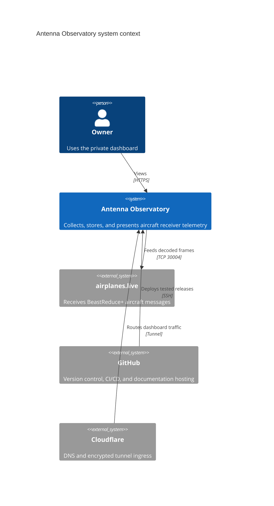
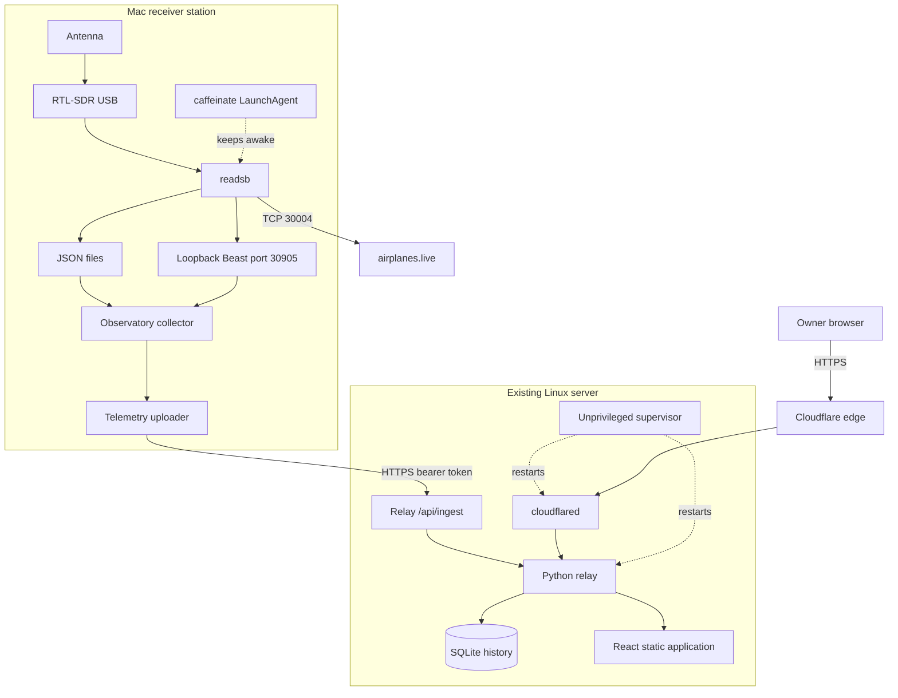
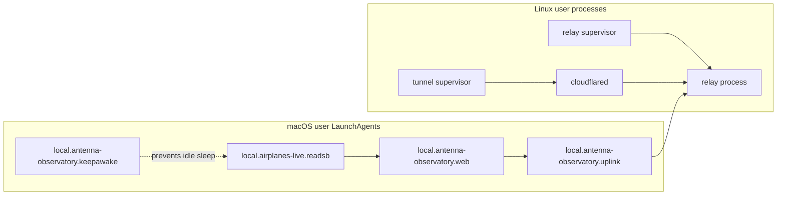
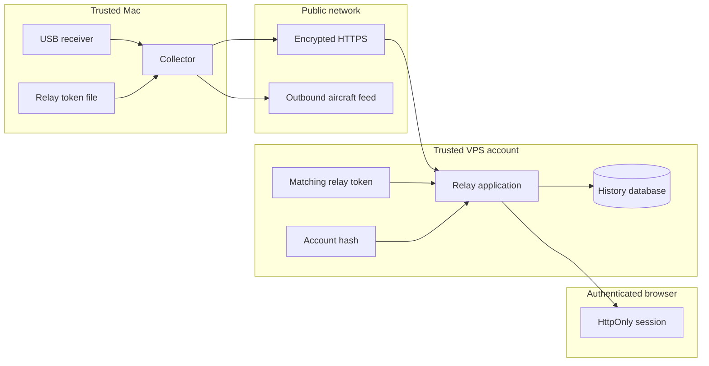
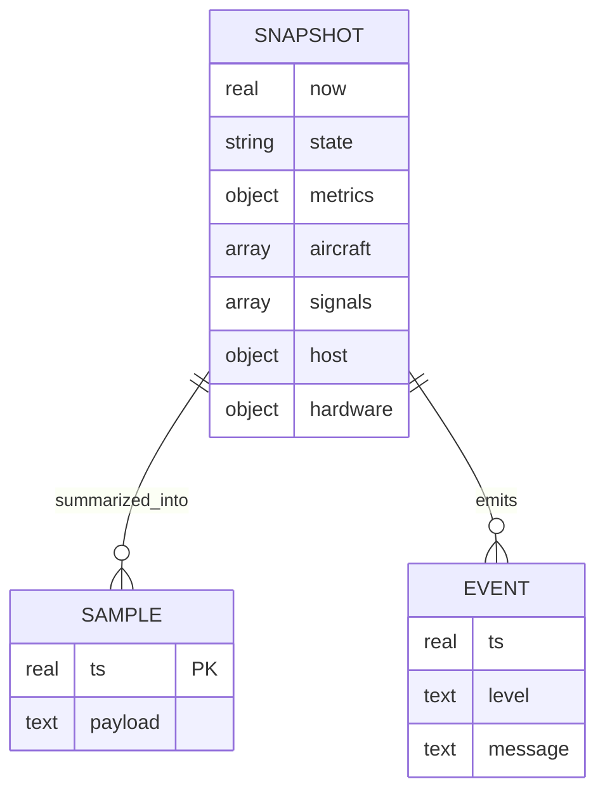

# Architecture

The system separates radio decoding, transport, presentation, and documentation. The Mac remains the source of truth for live RF data; the Linux relay is the source of truth for remotely visible telemetry history.

## System context

## Deployment topology

## Process ownership

## Trust boundaries

The relay binds only to loopback. Cloudflare Tunnel makes the application reachable without opening an inbound VPS port. SSH deployment uses a dedicated key, and the wiki synchronization uses a different repository-scoped deploy key.

## Data model

Samples and events use seven-day rolling retention. The latest relay snapshot and a bounded decoder-log tail are also persisted so a relay restart can recover the last known view.
