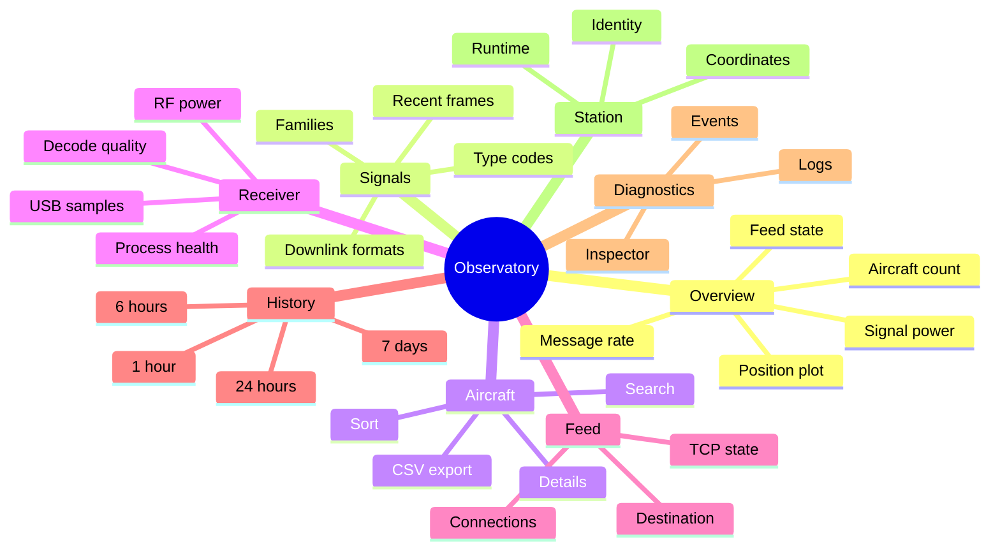

# Dashboard guide

The React interface is statically built and served by the Python relay. It fetches snapshots every two seconds and history separately so chart updates do not block the live view.

## Information architecture

## Overview

Use Overview for a quick answer to four questions: Is the receiver fresh? How many aircraft are active? How many valid messages arrive each second? Is the airplanes.live TCP connection established?

The position plot uses received latitude and longitude values. When station coordinates are configured locally, the collector also supplies range and bearing. A target counts as active when it was seen within 15 seconds.

## Signals

Signal cards show the trailing 60-second frame rate, session total, and aircraft count for each family. Selecting a card filters formats and recent frames. A zero can be normal: TIS-B and ADS-R depend on nearby ground infrastructure and radio conditions.

## Aircraft

Search callsign, ICAO hex, or squawk. Sort by identity, altitude, speed, signal, message count, or age. On phones, each target becomes a card; selecting it opens a full-height detail sheet with navigation, integrity, position, and raw fields.

The CSV export prefixes spreadsheet-formula characters in text fields so a callsign cannot become an executable spreadsheet formula.

## Receiver

Receiver values have different meanings:

- **Mean signal and noise** are relative dBFS values from the decoder.
- **Signal above noise** is a derived difference in dB.
- **Strong percent** counts accepted messages above −3 dBFS and can reveal overload.
- **Corrected percent** reflects accepted messages that needed bit correction.
- **Samples lost or dropped** indicate USB or processing pressure.
- **CPU work** breaks down readsb decoder subsystems.

## History

Charts display real stored samples. Missing or stale periods remain visible as gaps. Click or tap legend labels to isolate series; change the range without leaving the page.

## Inspector

Inspector is the most detailed view. Choose snapshot, receiver statistics, raw aircraft, or host state, then filter field names and values. Tables use fixed responsive columns and wrap long nested values to avoid the overlap that can occur with unconstrained telemetry.

!!! info "Telemetry can describe real aircraft"
The dashboard intentionally publishes received aircraft telemetry. Receiver ingestion remains token-protected and station-setting writes remain local-only.
