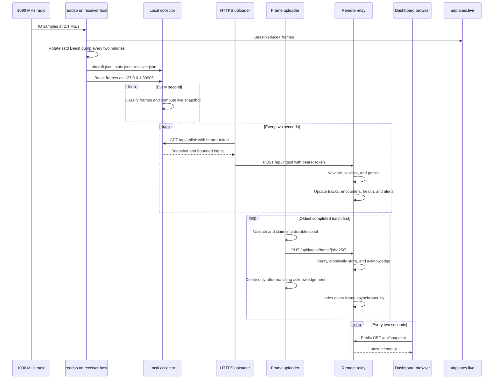
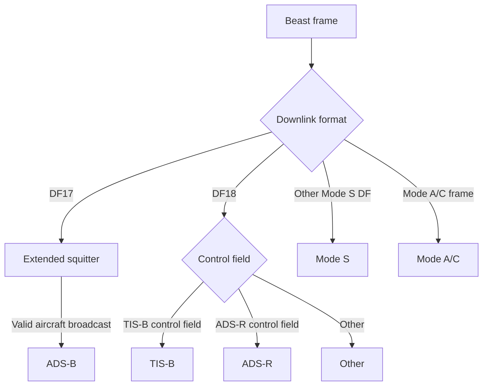
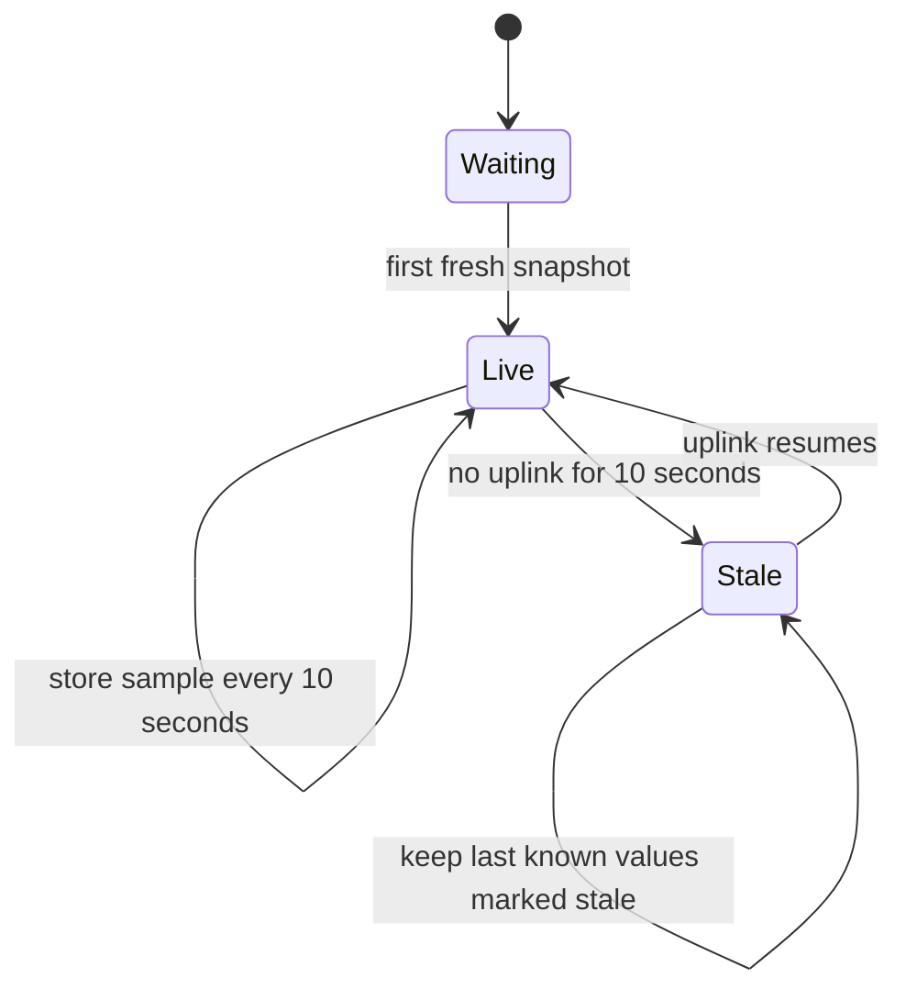

# Data pipeline

## End-to-end flow



## Collector inputs

| Source                             | Contents                                                 | Typical update   |
| ---------------------------------- | -------------------------------------------------------- | ---------------- |
| `aircraft.json`                    | Aircraft fields, seen ages, positions, message totals    | 1 second         |
| `stats.json`                       | Decoder counters, gain, signal, noise, samples, CPU work | About 10 seconds |
| `receiver.json`                    | Decoder identity and runtime metadata                    | Decoder-managed  |
| Beast TCP 30005 (Pi) / 30905 (Mac) | Raw framed Mode S messages with signal byte              | Continuous       |
| Host process inspection            | PID, state, memory, CPU, established sockets             | 10 seconds       |

The collector calculates current message rate from consecutive aircraft snapshots. It classifies recent Beast frames, measures per-family rate over the trailing 60 seconds, and preserves `null` when a measurement is unavailable. It never fills telemetry gaps with invented values.

## Signal classification



See the [signal guide](signals.md) for field semantics and measurement limits.

## Uplink envelope

The uploader requests a protected local endpoint, then posts a bounded JSON object to the remote relay:

```json
{
  "snapshot": {
    "now": 0,
    "state": "live",
    "metrics": {},
    "aircraft": [],
    "signals": [],
    "events": [],
    "host": {},
    "hardware": {}
  },
  "logs": []
}
```

The relay rejects missing collections, non-finite timestamps, oversized requests, malformed logs, and incorrect bearer tokens. It copies the accepted object through strict JSON serialization before storing it.

## Complete decoded-frame archive

`readsb --dump-beast` writes every accepted Mode A/C, Mode S, and ADS-B frame with receiver ticks, signal byte, and synthetic wall-clock markers. The frame uploader never touches the SDR or changes the direct airplanes.live connector. It validates completed Zstandard files, moves them into a restart-safe spool, and uploads them oldest-first with content-addressed identities.

The relay validates each compressed batch before durable acknowledgement, then a background worker indexes its frames transactionally. Duplicate PUT requests are successful no-ops. Processed batches and frame rows expire after 72 hours; aggregate dashboard samples retain their existing seven-day window.

## Retention and freshness



Charts downsample long ranges to at most roughly 480 plotted points. Buckets containing stale data or gaps over 30 seconds retain a gap in reception-dependent series.

Track replay changes resolution with the requested range: ten seconds for one hour, twenty seconds for six hours, one minute for one day, and five minutes for seven days. Coverage uses 72 five-degree sectors. Encounter sessions increment only after a target has been absent for more than 15 minutes.
