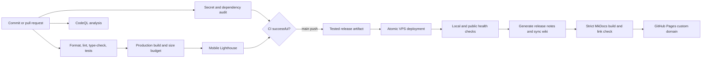
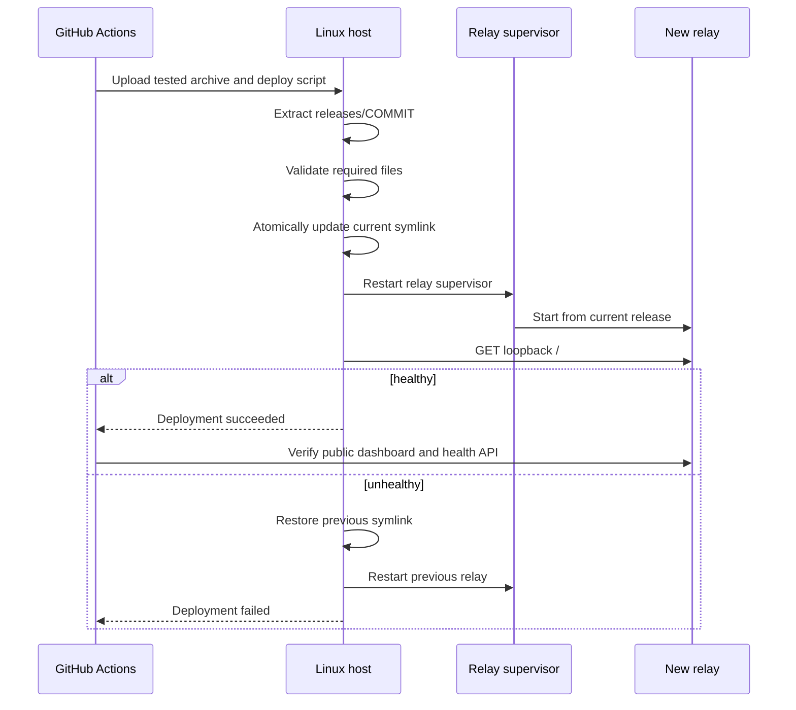

# Deployment and CI/CD

Every production change follows the same source-to-release path. The tested artifact is the artifact deployed; the remote host does not install Node dependencies or rebuild source.

The Linux relay requires `zstd` on `PATH`. Deployment checks this prerequisite before changing the active release so a missing decoder cannot replace a healthy production version.

## Pipeline

## Continuous integration stages

| Stage           | Gate                                                                                             |
| --------------- | ------------------------------------------------------------------------------------------------ |
| Source safety   | Reject live feeder UUIDs, absolute Mac user paths, private-key markers, and GitHub-token formats |
| Formatting      | `oxfmt --check`                                                                                  |
| Static quality  | `oxlint` and TypeScript `tsc --noEmit`                                                           |
| Reliability     | Python backend unit and HTTP-boundary tests                                                      |
| Build           | Reproducible `pnpm install --frozen-lockfile` and production Vinext build                        |
| Performance     | Whole-site, JavaScript/CSS, and single-asset budgets                                             |
| Browser quality | Public mobile Lighthouse performance, accessibility, best-practice, LCP, and CLS thresholds      |
| Secrets         | Gitleaks scans complete Git history                                                              |
| Dependencies    | Production audit on every change and dependency review on pull requests                          |
| Static security | Scheduled and change-triggered CodeQL with extended JavaScript/TypeScript and Python queries     |

Dependabot checks npm and GitHub Actions weekly. Every third-party action is pinned to an immutable commit SHA.

## Production release

Application state lives outside every release, so rollback does not replace the history database, accepted snapshots, relay token, or tunnel configuration. Five release directories are retained.

## Required GitHub configuration

The main repository holds these Actions secrets:

| Secret            | Purpose                                                                  |
| ----------------- | ------------------------------------------------------------------------ |
| `VPS_HOST`        | Deployment host name or address                                          |
| `VPS_USER`        | Unprivileged deployment account                                          |
| `VPS_HOST_KEY`    | Pinned SSH known-host entry                                              |
| `VPS_DEPLOY_KEY`  | Dedicated private key accepted only by the server account                |
| `WIKI_DEPLOY_KEY` | Private half of a write-enabled deploy key scoped to the wiki repository |

The relay bearer token, Cloudflare tunnel token, and receiver UUID are not GitHub Actions secrets because a code release does not need them.

## Wiki publication

`wiki-site/` in the main repository is canonical. After a successful production deploy, the release workflow copies that directory into `antenna_observatory_wiki`, writes release notes from the deployed Git commit, and pushes with the wiki-only deploy key. The wiki repository then builds with strict warnings and deploys to GitHub Pages.
