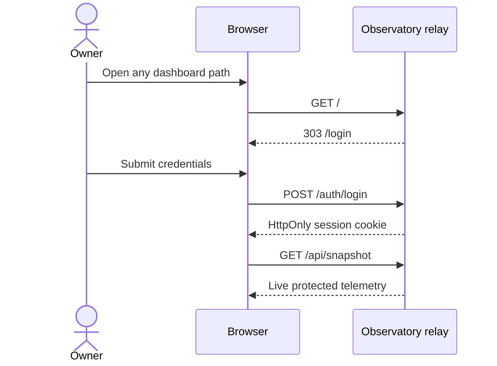

# Access and use

## Open the dashboard

Visit [antenna.ramideltoro.com](https://antenna.ramideltoro.com). The application redirects every anonymous page request to `/login`, and anonymous API requests return HTTP 401. Enter the single owner account configured on the server.

Credentials are deliberately absent from this public documentation and repository. The password is stored on the server only as a salted PBKDF2-SHA256 hash.

## Navigate

The transparent menu button stays fixed at the upper-left corner. It opens every dashboard section and the sign-out action:

1. **Overview** — current aircraft, message rate, power, feed state, position plot, and health summary.
2. **Signals** — signal-family rates, downlink formats, ADS-B type codes, and recent frames.
3. **Aircraft** — searchable and sortable aircraft with a mobile card layout.
4. **Receiver** — gain, noise, decode quality, USB loss, CPU, memory, and hardware limits.
5. **Feed** — airplanes.live transport state and active TCP connections.
6. **History** — real samples over one hour through seven days.
7. **Events** — receiver transitions and decoder log output.
8. **Inspector** — every collected field in structured and raw JSON form.
9. **Station** — station identity, coordinates, and operating information.

## Read the live state

| State                | Meaning                                                             | First action                               |
| -------------------- | ------------------------------------------------------------------- | ------------------------------------------ |
| Receiving            | Fresh readsb data reached the remote relay.                         | No action needed.                          |
| Receiver stale       | The relay has data, but no new snapshot arrived recently.           | Check that the Mac is awake and online.    |
| Collector offline    | The browser cannot reach the API.                                   | Check the public domain and relay service. |
| Feed disconnected    | Local reception works, but the airplanes.live TCP socket is absent. | Inspect the readsb log and network.        |
| Waiting for receiver | No usable snapshot has arrived since service start.                 | Check USB ownership and readsb.            |

## Mobile behavior

The header, fixed menu, charts, tables, cards, inspector fields, and footer adapt below tablet width. Aircraft tables become cards, long telemetry values wrap, and every control keeps at least a 44-pixel touch target. Rotate the phone for wider charts when comparing many signal families.
