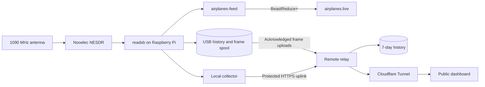

# Antenna Observatory

1090 MHz · live receiver

Antenna Observatory turns a Nooelec software-defined radio attached to a Raspberry Pi into a public, mobile-friendly aircraft reception dashboard. The Pi decodes ADS-B and Mode S traffic, feeds airplanes.live through its dedicated feeder, and uploads telemetry and archived frames to the existing remote server. A formatted 32 GB USB drive stores local history and the upload backlog. The Mac is no longer required.

[Open the dashboard](https://antenna.ramideltoro.com){ .md-button .md-button--primary }
[Browse the source](https://github.com/ramideltoro/antenna_observatory){ .md-button }
[Open Skyglow](https://skyglow.ramideltoro.com){ .md-button }

## Find what you need

- :material-raspberry-pi:{ .lg .middle } **Build the receiver**

  ***

  Install the Pi collector and uploaders, configure USB storage, and verify automatic startup.

  [:octicons-arrow-right-24: Raspberry Pi setup](pi-setup.md)

- :material-radar:{ .lg .middle } **Understand the signals**

  ***

  Learn how ADS-B, Mode S, TIS-B, ADS-R, and Mode A/C are classified and measured.

  [:octicons-arrow-right-24: Signal guide](signals.md)

- :material-chart-timeline-variant:{ .lg .middle } **Use the dashboard**

  ***

  Read live aircraft, signal power, receiver health, feed state, history, events, and raw telemetry.

  [:octicons-arrow-right-24: Dashboard guide](dashboard.md)

- :material-chart-areaspline:{ .lg .middle } **Explore receiver intelligence**

  ***

  Compare polar coverage, replay flights, search encounters, read daily reports, and interpret smart alerts.

  [:octicons-arrow-right-24: Intelligence features](intelligence.md)

- :material-lan:{ .lg .middle } **Operate the system**

  ***

  Check services, interpret logs, recover a stale feed, deploy safely, and roll back a release.

  [:octicons-arrow-right-24: Operations runbook](operations.md)

## Current deployment

The Pi runs the decoder, airplanes.live feed and MLAT client, collector, telemetry uploader, and frame uploader. All six services were verified after a full reboot. The public relay and its existing history remain on the VPS. USB storage uses ext4, mounts by UUID, and provides about 28 GB of usable free space after setup. Frame uploads reserve 2 GiB for disk safety.

MLAT is enabled with an estimated antenna location and elevation; being configured does not guarantee current peer synchronization. The [Mac setup](mac-setup.md) is retained as a legacy rollback reference.

## Related project: Skyglow

Skyglow uses the receiver as a multi-band observatory for aircraft, replay, airband and NOAA audio, Meteor satellite captures, and compatible wireless sensors. Its independent wiki covers those modes, its iPhone interface, and its own release history.

[Open the Skyglow wiki](https://wiki.skyglow.ramideltoro.com){ .md-button .md-button--primary }
[Open Skyglow](https://skyglow.ramideltoro.com){ .md-button }

## Design goals

| Goal                            | How the project meets it                                                                  |
| ------------------------------- | ----------------------------------------------------------------------------------------- |
| Keep radio work local           | The USB receiver and `readsb` run on the Raspberry Pi.                                    |
| Keep airplanes.live independent | The Pi’s dedicated feeder connects independently of the dashboard.                        |
| Make history available anywhere | The relay stores seven days of samples, tracks, encounters, events, and reports.          |
| Protect receiver controls       | Read views are public; ingest uses a bearer token and settings remain local-only.         |
| Recover automatically           | Pi systemd services start at boot; remote supervisors restart the relay and tunnel.       |
| Ship safely                     | CI scans, tests, builds, budgets, deploys atomically, verifies, and can roll back.        |
| Work on phones                  | Responsive layouts, touch targets, reduced motion, and high-contrast radar amber styling. |

!!! info "One receiver, one frequency at a time"
This receiver is dedicated to 1090 MHz aircraft traffic. Receiving FM, weather radio, airband voice, or 978 MHz UAT at the same time requires another receiver.
