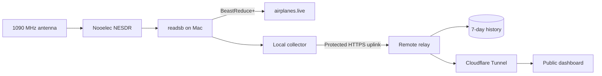

# Antenna Observatory

1090 MHz · live receiver

Antenna Observatory turns a Nooelec software-defined radio attached to a Mac into a public, mobile-friendly aircraft reception dashboard. The Mac decodes ADS-B and Mode S traffic, sends aircraft data directly to airplanes.live, and uploads telemetry through a protected ingest channel to a small remote server.

[Open the dashboard](https://antenna.ramideltoro.com){ .md-button .md-button--primary }
[Browse the source](https://github.com/ramideltoro/antenna_observatory){ .md-button }
[Open Skyglow](https://skyglow.ramideltoro.com){ .md-button }

## Find what you need

- :material-apple:{ .lg .middle } **Build the receiver**

  ***

  Reproduce the complete Homebrew, RTL-SDR, readsb, airplanes.live, LaunchAgent, and keep-awake setup.

  [:octicons-arrow-right-24: Mac setup](mac-setup.md)

- :material-radar:{ .lg .middle } **Understand the signals**

  ***

  Learn how ADS-B, Mode S, TIS-B, ADS-R, and Mode A/C are classified and measured.

  [:octicons-arrow-right-24: Signal guide](signals.md)

- :material-chart-timeline-variant:{ .lg .middle } **Use the dashboard**

  ***

  Read live aircraft, signal power, receiver health, feed state, history, events, and raw telemetry.

  [:octicons-arrow-right-24: Dashboard guide](dashboard.md)

- :material-chart-areaspline:{ .lg .middle } **Explore receiver intelligence**

  ***

  Compare polar coverage, replay flights, search encounters, read daily reports, and interpret smart alerts.

  [:octicons-arrow-right-24: Intelligence features](intelligence.md)

- :material-lan:{ .lg .middle } **Operate the system**

  ***

  Check services, interpret logs, recover a stale feed, deploy safely, and roll back a release.

  [:octicons-arrow-right-24: Operations runbook](operations.md)

## Related project: Skyglow

Skyglow uses the receiver as a multi-band observatory for aircraft, replay, airband and NOAA audio, Meteor satellite captures, and compatible wireless sensors. Its independent wiki covers those modes, its iPhone interface, and its own release history.

[Open the Skyglow wiki](https://wiki.skyglow.ramideltoro.com){ .md-button .md-button--primary }
[Open Skyglow](https://skyglow.ramideltoro.com){ .md-button }

## Design goals

| Goal                            | How the project meets it                                                                  |
| ------------------------------- | ----------------------------------------------------------------------------------------- |
| Keep radio work local           | The USB receiver and `readsb` remain on the Mac.                                          |
| Keep airplanes.live independent | `readsb` connects directly to the feed destination.                                       |
| Make history available anywhere | The relay stores seven days of samples, tracks, encounters, events, and reports.          |
| Protect receiver controls       | Read views are public; ingest uses a bearer token and settings remain local-only.         |
| Recover automatically           | LaunchAgents, a keep-awake service, and the Linux supervisor restart failed processes.    |
| Ship safely                     | CI scans, tests, builds, budgets, deploys atomically, verifies, and can roll back.        |
| Work on phones                  | Responsive layouts, touch targets, reduced motion, and high-contrast radar amber styling. |

!!! info "One receiver, one frequency at a time"
This receiver is dedicated to 1090 MHz aircraft traffic. Receiving FM, weather radio, airband voice, or 978 MHz UAT at the same time requires another receiver.
