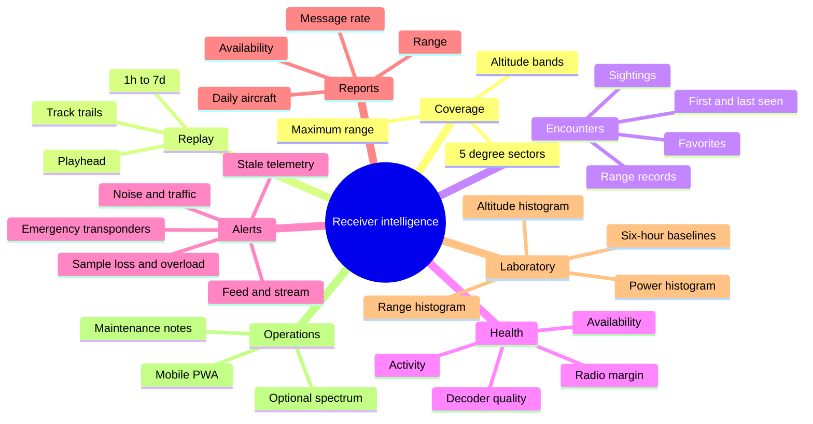
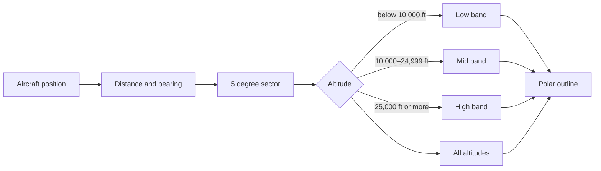
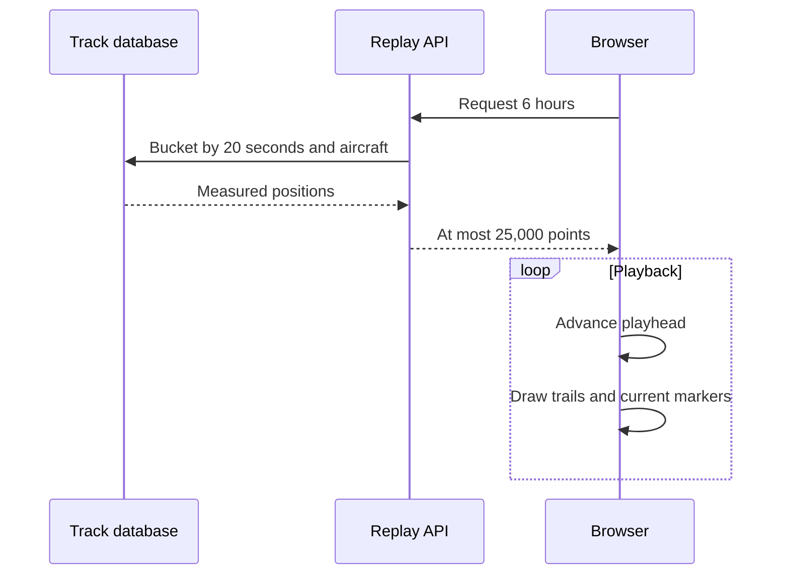
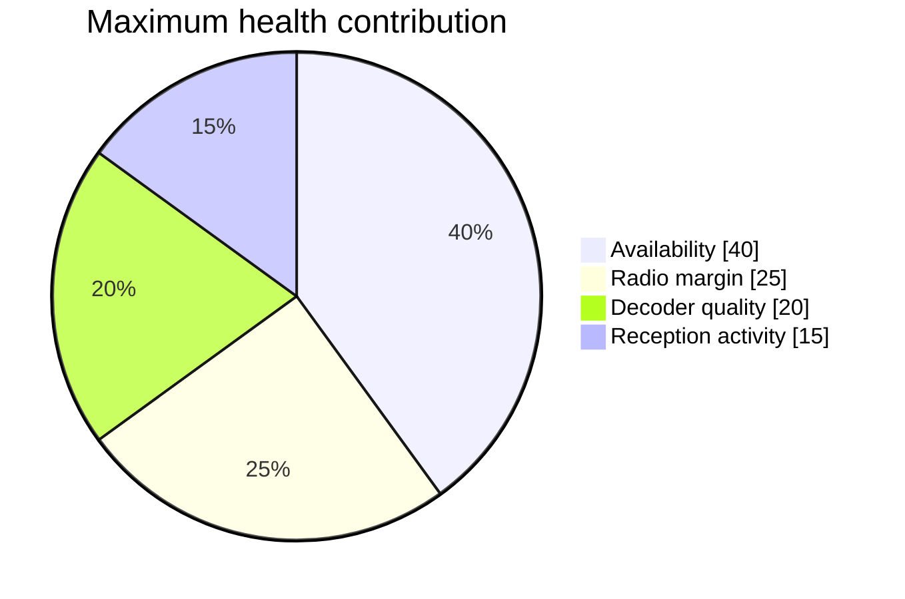
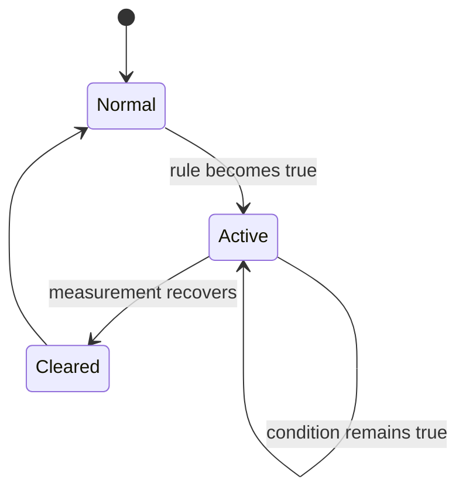
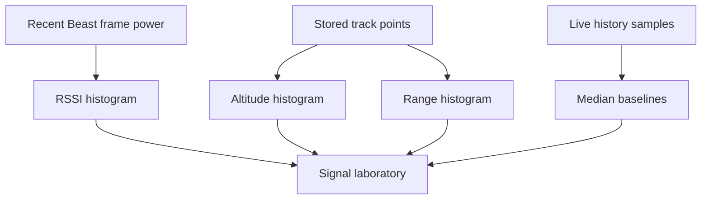
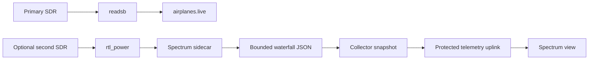

# Receiver intelligence

The observatory turns current aircraft telemetry into useful station history while preserving the distinction between a measured value, a derived value, and an unavailable value.

## Feature map

## Historical coverage

Every positioned track contributes its station-relative bearing and distance. Bearings are assigned to 72 sectors, each five degrees wide. The polar outline joins the maximum measured distance in each sector.

The shape is an observed reception envelope, not a prediction of RF propagation. Aircraft availability, altitude, terrain, buildings, antenna placement, and traffic routes all affect it.

## Flight time machine

Replay groups positions by aircraft and moves a playhead through retained time. Trails show the received path relative to the station. Resolution becomes coarser for longer ranges to bound browser and network work.

## Encounter history

An encounter is a rollup for one ICAO address within the seven-day retention window. Observations fewer than 15 minutes apart belong to one sighting. A later return increments the sighting count. The rollup retains first and last seen times, observation count, closest and farthest range, strongest decoded power, maximum altitude, and recent identity fields.

Favorites are stored in the browser’s local storage. They are a display preference and are not sent with telemetry.

## Antenna health score

| Component       | Maximum | Inputs                                                                 |
| --------------- | ------: | ---------------------------------------------------------------------- |
| Availability    |      40 | Fresh telemetry, local Beast stream, airplanes.live TCP connection     |
| Radio margin    |      25 | Mean decoded signal minus decoder noise floor                          |
| Decoder quality |      20 | Sample loss and percentage of accepted messages above −3 dBFS          |
| Activity        |      15 | Nonzero message rate and comparison with the six-hour live-data median |

Status bands are **Excellent** at 90 or above, **Healthy** at 75–89, **Attention** at 55–74, and **Critical** below 55. A quiet air-traffic period does not by itself zero the score because activity contributes only 15 points.

## Smart alerts

Rules cover stale telemetry, Beast stream loss, airplanes.live disconnect, tuner sample loss, strong-signal overload, a noise-floor rise greater than 6 dB over its six-hour median, message rate below 25% of a meaningful baseline, and emergency transponder state or squawk 7500/7600/7700.

Browser notifications are optional. They appear for new conditions while the dashboard or installed app is open. The event log retains alert transitions for seven days.

## Daily reports and signal laboratory

Daily reports group real ten-second samples and track points by the server’s local calendar day. They show availability, average and peak message rate, peak simultaneous aircraft, average decoded power, unique aircraft, position count, and maximum range.

The signal laboratory presents distributions rather than a single average:

## Maintenance annotations

Use annotations to explain a measurable change. Useful entries include antenna relocation, element extension, coax or adapter replacement, gain changes, receiver replacement, macOS or readsb updates, weather damage, and outages. Changes are accepted only from the loopback dashboard on the receiver Mac, validated, and mirrored to the hosted timeline through the protected telemetry uplink.

## Progressive web app

The service worker intentionally has no cache handler because offline telemetry would be stale. The app icon, standalone display, and mobile layout remain available when the browser supports installation.

## Spectrum waterfall

One SDR cannot continuously decode 1090 MHz while also retuning for a spectrum sweep. The observatory protects the primary receiver and enables the waterfall only when a second serial-numbered device writes valid sidecar data.

The sidecar checks that its selected device differs from the protected readsb serial before invoking `rtl_power`. A missing second receiver produces an explanatory readiness view and never pauses the active feed.
