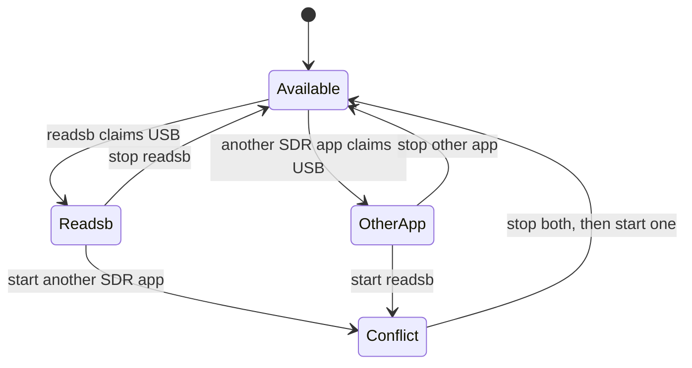

# Mac receiver setup

This page records the complete receiver setup used by the project. Commands target an Apple Silicon Mac with Homebrew under `/opt/homebrew`; Intel Homebrew paths may differ.

## 1. Assemble and place the antenna

1. Attach the coaxial antenna connector firmly to the NESDR SMArt v5.
2. Extend the metal telescoping antenna before evaluating reception.
3. Keep the antenna vertical for vertically polarized 1090 MHz signals.
4. Place it near a window or outdoors with the widest safe view of the sky.
5. Connect the SDR to the Mac, using a short USB extension if that reduces computer noise or connector strain.

An unextended whip can still receive nearby aircraft, but it makes range and signal comparisons misleading.

## 2. Install Homebrew and radio tools

Verify Homebrew first:

```bash
brew --version
```

If the command is missing, install Homebrew from [brew.sh](https://brew.sh), reopen Terminal, and verify again. Then install the RTL-SDR library, decoders, and the selected long-running decoder:

```bash
brew install librtlsdr
brew install dump1090-fa
brew install readsb
```

`dump1090-fa` was installed during initial testing. The production service uses `readsb` because it exposes the JSON, statistics, Beast stream, gain control, and network connector needed by the observatory.

## 3. Confirm the USB receiver

Run a continuous sample test:

```bash
rtl_test -s 2400000
```

A healthy result identifies one Nooelec device, the Rafael Micro R820T tuner, and starts reading at 2.4 million samples per second. Let it run for several seconds and press ++control+c++. A result of zero samples lost is ideal.

!!! note "PLL message during startup"
A one-time `PLL not locked` line followed by continuous sampling does not by itself mean the test failed. Confirm that reading starts and sample loss remains acceptable.

## 4. Test live aircraft decoding

Only one program can claim the RTL-SDR at a time. Stop `rtl_test`, Skyglow, SDR++, or any other radio process before starting readsb.

```bash
readsb --device-type rtlsdr --gain auto --net --interactive
```

The interactive table should begin listing ICAO hex addresses and may add callsign, altitude, speed, heading, position, signal strength, and message count as each aircraft transmits more fields.



## 5. Configure airplanes.live

Create or retrieve the receiver UUID from the airplanes.live feed setup. Treat it as station identity and keep it out of public source files. Test the final connector with placeholders replaced locally:

```bash
readsb \
  --device-type rtlsdr \
  --device YOUR_DEVICE_SERIAL \
  --gain auto \
  --net \
  --interactive \
  --net-connector feed.airplanes.live,30004,beast_reduce_plus_out,uuid=YOUR_FEED_UUID
```

Confirm reception on [airplanes.live MyFeed](https://airplanes.live/myfeed/). A TCP connection proves transport is established; MyFeed provides the destination’s view of accepted data.

## 6. Install the production readsb LaunchAgent

The repository’s `ops/local.airplanes-live.readsb.plist` is a public template. Render its three placeholders into a private file:

```bash
cd antenna_observatory
export DEVICE_SERIAL='YOUR_DEVICE_SERIAL'
export AIRPLANES_LIVE_UUID='YOUR_FEED_UUID'
sed \
  -e "s|__HOME__|$HOME|g" \
  -e "s|__DEVICE_SERIAL__|$DEVICE_SERIAL|g" \
  -e "s|__AIRPLANES_LIVE_UUID__|$AIRPLANES_LIVE_UUID|g" \
  ops/local.airplanes-live.readsb.plist \
  > "$HOME/Library/LaunchAgents/local.airplanes-live.readsb.plist"
unset DEVICE_SERIAL AIRPLANES_LIVE_UUID
```

The production arguments also write one-second JSON files to the observatory state directory, bind the local Beast output to `127.0.0.1:30905`, and enable Mode A/C detection.

Validate and start it:

```bash
plutil -lint "$HOME/Library/LaunchAgents/local.airplanes-live.readsb.plist"
launchctl bootstrap "gui/$(id -u)" "$HOME/Library/LaunchAgents/local.airplanes-live.readsb.plist"
launchctl print "gui/$(id -u)/local.airplanes-live.readsb" \
  | grep -E 'state =|pid =|last exit code'
```

Expected log evidence includes the selected RTL-SDR device and `Connection established: feed.airplanes.live ... port 30004`.

## 7. Keep reception running while the screen is locked

Locking the screen does not stop user LaunchAgents, but system sleep stops USB sampling and networking. Install the keep-awake service:

```bash
cp ops/local.antenna-observatory.keepawake.plist \
  "$HOME/Library/LaunchAgents/local.antenna-observatory.keepawake.plist"
plutil -lint "$HOME/Library/LaunchAgents/local.antenna-observatory.keepawake.plist"
launchctl bootstrap "gui/$(id -u)" \
  "$HOME/Library/LaunchAgents/local.antenna-observatory.keepawake.plist"
```

It runs `/usr/bin/caffeinate -is`: `-i` prevents idle sleep and `-s` prevents system sleep while AC power is present. Display sleep and screen locking remain available. User LaunchAgents start after login; a fully logged-out Mac does not run them.

## 8. Build and install the local collector

```bash
pnpm install --frozen-lockfile
pnpm build
python3 ops/install-local.py
```

The installer copies the built app and Python service under `~/Library/Application Support/AntennaObservatory`, creates a `KeepAlive` web LaunchAgent, and preserves the previous installed app for rollback.

The local dashboard is available at `http://127.0.0.1:8787`.

## 9. Enable the protected remote uplink

The Mac and remote relay must hold the same random relay token in mode-0600 state files. The public repository contains no token. Render the uplink plist’s `__HOME__` placeholder, validate it, and load it after the protected state has been provisioned.

```bash
sed "s|__HOME__|$HOME|g" ops/local.antenna-observatory.uplink.plist \
  > "$HOME/Library/LaunchAgents/local.antenna-observatory.uplink.plist"
plutil -lint "$HOME/Library/LaunchAgents/local.antenna-observatory.uplink.plist"
launchctl bootstrap "gui/$(id -u)" \
  "$HOME/Library/LaunchAgents/local.antenna-observatory.uplink.plist"
```

## 10. Verify the complete station

```bash
launchctl print "gui/$(id -u)/local.airplanes-live.readsb" | grep -E 'state =|pid ='
launchctl print "gui/$(id -u)/local.antenna-observatory.web" | grep -E 'state =|pid ='
launchctl print "gui/$(id -u)/local.antenna-observatory.uplink" | grep -E 'state =|pid ='
launchctl print "gui/$(id -u)/local.antenna-observatory.keepawake" | grep -E 'state =|pid ='
tail -n 30 "$HOME/Library/Logs/airplanes-live.log"
tail -n 30 "$HOME/Library/Logs/antenna-observatory-uplink.log"
```

Then lock the screen for several minutes and confirm that MyFeed and the dashboard continue updating.
