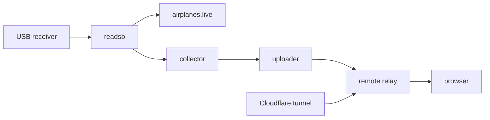

# Operations runbook

## Normal service chain



Check from left to right. A downstream failure does not always affect an upstream service: the dashboard uplink can fail while airplanes.live continues receiving directly from readsb.

## Mac service checks

```bash
for label in \
  local.airplanes-live.readsb \
  local.antenna-observatory.web \
  local.antenna-observatory.uplink \
  local.antenna-observatory.keepawake
do
  launchctl print "gui/$(id -u)/$label" | grep -E 'state =|pid =|last exit code'
done
```

`state = running` or an active PID indicates the job is loaded. `KeepAlive` restarts an unexpected exit after the configured throttle interval.

## Logs

| Component                           | macOS log                                       |
| ----------------------------------- | ----------------------------------------------- |
| readsb and airplanes.live connector | `~/Library/Logs/airplanes-live.log`             |
| Local web collector                 | `~/Library/Logs/antenna-observatory.log`        |
| Remote telemetry uploader           | `~/Library/Logs/antenna-observatory-uplink.log` |
| Old Mac tunnel rollback service     | `~/Library/Logs/antenna-observatory-tunnel.log` |

On Linux, the unprivileged supervisors write relay and tunnel logs under `~/.local/state/antenna-observatory/`.

## Restart a Mac job

Use `kickstart` for a routine restart:

```bash
launchctl kickstart -k "gui/$(id -u)/local.airplanes-live.readsb"
```

Use the same command with another label for the collector, uploader, or keep-awake job. Avoid loading two decoder jobs because only one can claim the USB device.

## Deployments and rollback

Production releases are immutable directories named by the full Git commit. The `current` symlink changes atomically after extraction and validation. The deployment script restarts only the relay, checks its loopback dashboard, and restores the previous symlink if health does not recover.

The five newest releases are retained. To inspect the active target:

```bash
ssh antenna-observatory 'readlink "$HOME/antenna-observatory/current"'
```

## State and backup

Back up the remote state directory separately from releases. It contains:

- relay and tunnel token files;
- the SQLite history database and WAL files;
- latest accepted relay snapshot and bounded log tail;
- public-origin configuration.

Stop or quiesce the relay before making a raw SQLite filesystem copy, or use SQLite’s online backup command. Protect backups with the same care as production state.

## Routine maintenance

| Frequency          | Check                                                              |
| ------------------ | ------------------------------------------------------------------ |
| Daily              | Dashboard freshness and airplanes.live feed state                  |
| Weekly             | Decoder log for repeated restarts, USB loss, or reconnection loops |
| Weekly             | Dependabot and CodeQL results                                      |
| Monthly            | Range trend, strong-signal percentage, disk use, retained releases |
| After macOS update | Homebrew paths, LaunchAgent state, USB access, sleep behavior      |
| After antenna move | Position, coax connection, signal/noise trend, maximum range       |
