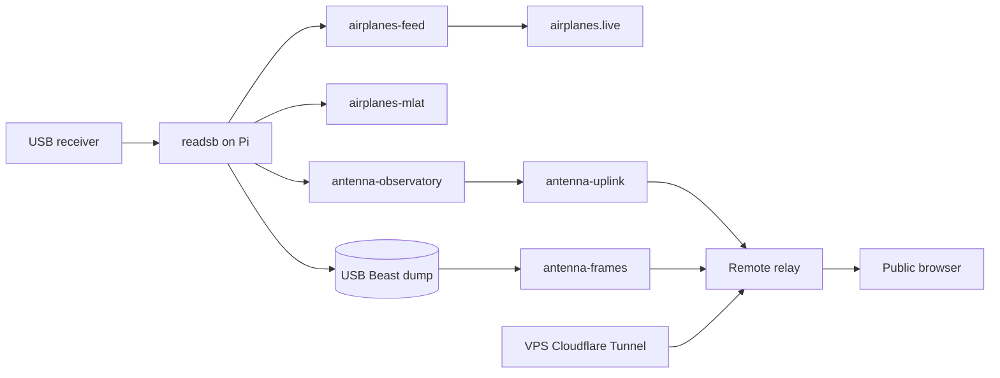

# Operations runbook

## Current service chain

The Raspberry Pi owns the USB radio and runs all receiver services. The public relay and Cloudflare Tunnel remain on the VPS. The old Mac jobs are disabled; no Mac login or keepawake service is needed.



A portal deployment does not restart the Pi decoder or its independent airplanes.live feed.

## Pi service checks

Run these commands on the Pi:

```sh
systemctl is-active readsb airplanes-feed airplanes-mlat antenna-observatory antenna-uplink antenna-frames
systemctl is-enabled readsb airplanes-feed airplanes-mlat antenna-observatory antenna-uplink antenna-frames
findmnt /mnt/antenna-storage
df -h / /var/lib/antenna-observatory
lsusb
```

All six services should be active and enabled. The storage mount should resolve to the USB ext4 volume. A quiet sky can produce few aircraft even while the services are healthy.

## Logs and restarts

```sh
journalctl -u readsb -u airplanes-feed -u airplanes-mlat -n 50 --no-pager
journalctl -u antenna-observatory -u antenna-uplink -u antenna-frames -n 50 --no-pager
sudo systemctl restart antenna-uplink
```

Restart only the component that needs recovery. Restarting `readsb` briefly interrupts reception; restarting an uploader does not. Linux receiver diagnostics use systemd, process statistics, external sockets, and journald.

Remote relay and tunnel supervisors write logs under `~/.local/state/antenna-observatory/` on the VPS. Those are distinct from the Pi's systemd services.

The Feed view reports pending batches, last capture/upload/process times, failures, and gaps. During an upload outage, the USB backlog grows. After reconnection it drains through acknowledged uploads. A general network outage can also interrupt airplanes.live; a relay-only outage need not.

## USB storage

The formatted 32 GB drive is labeled `ANTENNA_DATA` and mounted by UUID at `/mnt/antenna-storage`. The state symlink `/var/lib/antenna-observatory` points into that drive. It holds the collector database, settings, private relay token, frame dumps and retry spool. Live readsb JSON stays in `/run/readsb`.

The drive provided about 28 GB free after formatting. The uploader reserves 2 GiB; if free space drops below the reserve it removes the oldest unacknowledged batches and records gaps. The remote relay retains the detailed archive for 72 hours and aggregate history for seven days.

Keep the drive connected. Unit mount dependencies and mount-point conditions prevent fallback writes to the system card. Before intentionally removing it, stop the receiver and Observatory services, then unmount the volume.

## Private settings and maintenance

From another computer, open an SSH tunnel:

```sh
ssh -L 8788:127.0.0.1:8787 USER@PI_HOST
```

Open `http://127.0.0.1:8788` to edit station settings or maintenance annotations. Those writes remain restricted to a local connection. The public portal is read-only. Changing dashboard coordinates does not reconfigure MLAT; keep its antenna position consistent with the decoder configuration.

Record receiver moves, cable changes, upgrades, and outages in Maintenance. MLAT currently uses an estimated antenna location and elevation; verify precise coordinates when available.

## State and backup

Back up Pi and VPS state independently. Use SQLite's online backup API or stop the relevant service before copying a database; do not copy only the main SQLite file while ignoring an active WAL. Protect token files and backups. Code releases must not contain state or credentials.

The migration preserved 25,194 local samples, retained the remote history and archive, and left the old Mac files available for rollback. Do not run the Mac and Pi telemetry uploaders for the same station at once.

## Deployments and rollback

Canonical source and documentation live in the main repository. After protected-main CI succeeds, the release workflow deploys the VPS application and synchronizes the wiki repository. GitHub Pages then builds and publishes the wiki. See [deployment](deployment.md).

VPS releases use commit-named directories and an atomic `current` symlink, retaining five releases. A failed local health check restores the previous release. Pi application files live in `/opt/antenna-observatory`; the VPS release workflow does not automatically update that Pi copy. Follow [Pi setup](pi-setup.md) for receiver installation and rollback.

## Routine maintenance

| Frequency          | Check                                                               |
| ------------------ | ------------------------------------------------------------------- |
| Daily              | Fresh telemetry, airplanes.live feed, frame backlog and failures    |
| Weekly             | USB disconnects, decoder restarts, free storage and security checks |
| Monthly            | Range and signal trends; protected state backups                    |
| After Pi OS update | USB detection, mounted drive, all six services and public data      |
| After antenna move | Decoder, dashboard and MLAT position; signal/noise and range        |

A full reboot was used to verify automatic storage mounting and service recovery during migration.

## Optional spectrum receiver

The primary receiver is dedicated to 1090 MHz. A simultaneous spectrum waterfall requires a separate RTL-SDR. The bundled sidecar retains Homebrew-specific executable defaults and is not enabled on the Pi; port and configure it for Linux before use. Never assign the primary SDR to a competing receiver process.

## Legacy Mac operations

The [legacy Mac setup](mac-setup.md) documents LaunchAgents and keepawake behavior for rollback. Those jobs are disabled in the active installation. Leave the obsolete Mac public tunnel disabled; the VPS tunnel serves the public hostname.
