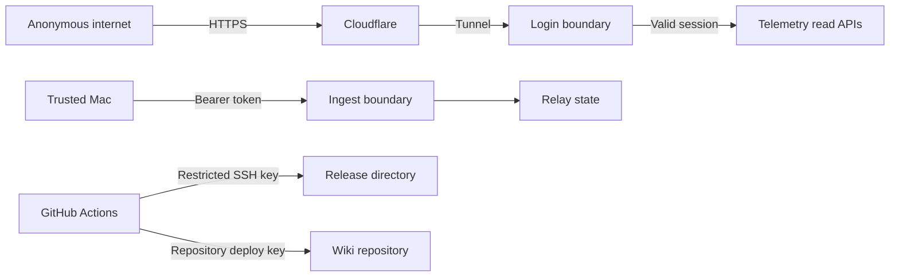

# Security model

## Controls by boundary

## Dashboard authentication

- Exactly one account record is configured.
- Passwords use PBKDF2-SHA256 with 600,000 iterations and a random 32-byte salt.
- Comparison uses constant-time functions.
- Sessions use random opaque 256-bit tokens and are stored only in relay memory.
- Cookies are `HttpOnly`, `SameSite=Strict`, path `/`, and `Secure` on HTTPS.
- Sessions bind to the request origin and expire within 12 hours.
- Per-client and global login throttles limit repeated attempts.
- A relay restart invalidates every active session.

Entering a deep URL does not bypass login. Static assets, React server-component paths, data APIs, history, logs, export, inspector data, and health data all require a valid session. The login page and the protected ingest route are the intended exceptions.

## Request validation

- Public hostnames and origins are allowlisted.
- State-changing requests require a matching Origin.
- Remote station-setting writes are denied; only the local loopback dashboard can change station details.
- Request sizes, JSON shapes, numeric finiteness, coordinates, log types, and collection types are validated.
- CSV text beginning with spreadsheet formula characters is escaped.
- Static paths are resolved and checked to remain inside the production build directory.

## Secret locations

| Secret                      | Storage                                      | Repository exposure |
| --------------------------- | -------------------------------------------- | ------------------- |
| Dashboard password          | Never stored; salted hash in protected state | None                |
| Relay bearer token          | Mode-0600 file on Mac and VPS                | None                |
| Cloudflare tunnel token     | Mode-0600 VPS state file                     | None                |
| VPS deployment private key  | GitHub Actions secret                        | None                |
| Wiki deployment private key | GitHub Actions secret                        | None                |
| Receiver feed UUID          | Private rendered LaunchAgent                 | Placeholder only    |

CI runs both a purpose-built public-source boundary check and Gitleaks over complete Git history. Dependency review blocks vulnerable or disallowed new dependencies, production dependency auditing rejects high-severity advisories, and CodeQL runs extended JavaScript/TypeScript and Python queries.

## Exposure limits

The Cloudflare Tunnel reaches a loopback-only relay. No inbound application port needs to be opened on the VPS. The Mac makes outbound connections to the relay and airplanes.live; it accepts the observatory and Beast endpoints only on loopback.

## Security response

If a credential might have been disclosed:

1. rotate the affected token or key immediately;
2. restart the dependent service;
3. revoke old sessions by restarting the relay;
4. review GitHub Actions, SSH, Cloudflare, and application logs;
5. remove leaked material from Git history before making the repository public again.

Report a suspected code vulnerability privately through the repository’s security policy rather than a public issue.
