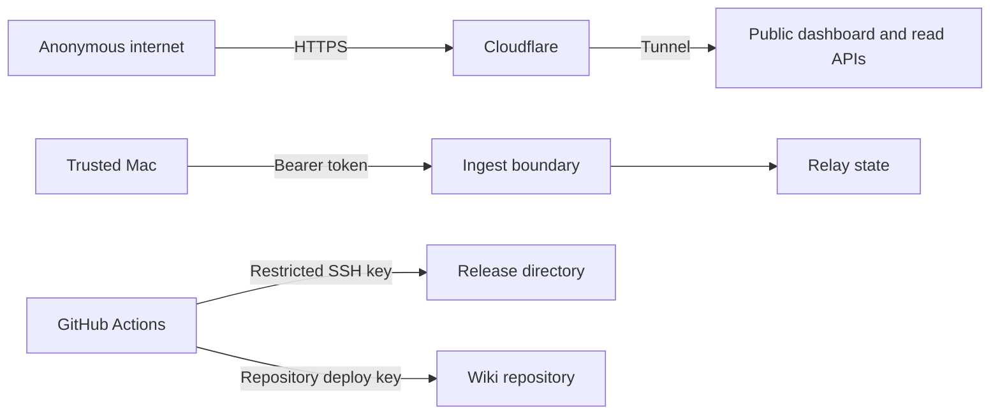

# Security model

## Controls by boundary

## Public read boundary

Static assets, React paths, live telemetry, history, logs, exports, inspector data, and health data are public by design. The server still validates the public hostname and serves through a loopback-only Cloudflare Tunnel target. `/login` is retained only as a compatibility redirect to `/`; no password or browser session is required.

The two write paths have narrower boundaries. `/api/ingest` accepts only the private relay bearer token shared with the Mac uploader. `/api/settings` accepts only loopback requests with a matching local origin, so internet visitors cannot change station metadata.

## Request validation

- Public hostnames and origins are allowlisted.
- State-changing requests require a matching Origin.
- Remote station-setting writes are denied; only the local loopback dashboard can change station details.
- Request sizes, JSON shapes, numeric finiteness, coordinates, log types, and collection types are validated.
- CSV text beginning with spreadsheet formula characters is escaped.
- Static paths are resolved and checked to remain inside the production build directory.

## Secret locations

| Secret                      | Storage                       | Repository exposure |
| --------------------------- | ----------------------------- | ------------------- |
| Relay bearer token          | Mode-0600 file on Mac and VPS | None                |
| Cloudflare tunnel token     | Mode-0600 VPS state file      | None                |
| VPS deployment private key  | GitHub Actions secret         | None                |
| Wiki deployment private key | GitHub Actions secret         | None                |
| Receiver feed UUID          | Private rendered LaunchAgent  | Placeholder only    |

CI runs both a purpose-built public-source boundary check and Gitleaks over complete Git history. Dependency review blocks vulnerable or disallowed new dependencies, production dependency auditing rejects high-severity advisories, and CodeQL runs extended JavaScript/TypeScript and Python queries.

## Exposure limits

The Cloudflare Tunnel reaches a loopback-only relay. No inbound application port needs to be opened on the VPS. The Mac makes outbound connections to the relay and airplanes.live; it accepts the observatory and Beast endpoints only on loopback.

## Security response

If a credential might have been disclosed:

1. rotate the affected token or key immediately;
2. restart the dependent service;
3. review GitHub Actions, SSH, Cloudflare, and application logs;
4. remove leaked material from Git history before making the repository public again.

Report a suspected code vulnerability privately through the repository’s security policy rather than a public issue.
