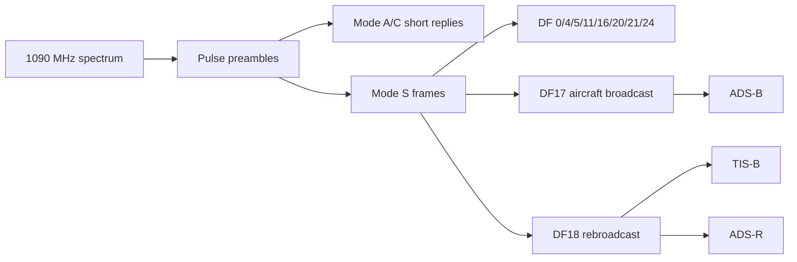
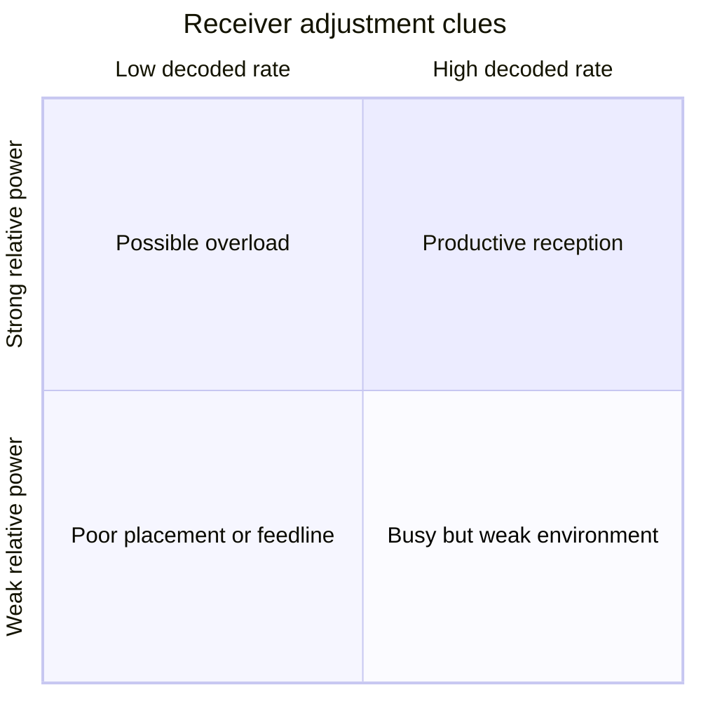

# Aircraft signal guide

The receiver is tuned to **1090.000 MHz** with a **2.4 MS/s** sample rate. It observes Mode S replies and extended squitter transmissions. Classification describes the decoded frame; it does not imply that every family is always present.

## Families

| Family   | Source                                 | Typical content                                                              |
| -------- | -------------------------------------- | ---------------------------------------------------------------------------- |
| ADS-B    | Aircraft, usually DF17                 | Identity, barometric/GNSS position, velocity, status, operational capability |
| Mode S   | Aircraft replies outside ADS-B         | Surveillance altitude, identity, Comm-B, all-call, air-to-air data           |
| TIS-B    | Ground surveillance rebroadcast        | Traffic reports for targets seen by ground radar or another link             |
| ADS-R    | Ground ADS-B rebroadcast               | ADS-B traffic translated from another data link                              |
| Mode A/C | Legacy short replies                   | Squawk identity or pressure altitude, without a Mode S CRC                   |
| Other    | Reserved or unclassified decoded forms | Frames that do not map cleanly to the supported families                     |

## Common downlink formats

|  DF | Meaning                                 |
| --: | --------------------------------------- |
|   0 | Short air-to-air surveillance           |
|   4 | Surveillance altitude reply             |
|   5 | Surveillance identity reply             |
|  11 | All-call reply                          |
|  16 | Long air-to-air surveillance            |
|  17 | ADS-B extended squitter                 |
|  18 | Extended squitter or ground rebroadcast |
|  19 | Military extended squitter              |
|  20 | Comm-B altitude reply                   |
|  21 | Comm-B identity reply                   |
|  24 | Comm-D extended-length message          |

## ADS-B type codes

Inside an extended squitter, the five-bit type code gives the payload family:

- TC 1–4: aircraft identification and category
- TC 5–8: surface position
- TC 9–18: airborne barometric position
- TC 19: airborne velocity
- TC 20–22: airborne GNSS position
- TC 28: aircraft status
- TC 29: target state and status
- TC 31: aircraft operational status

## Power measurements

readsb reports decoded signal and noise in **dBFS**, decibels relative to the receiver’s digital full scale. Values closer to 0 dBFS are stronger. These numbers are useful for comparing this receiver with itself over time.

They are not calibrated dBm at the antenna connector. The hardware does not expose antenna standing-wave ratio, impedance, receiver temperature, coax loss, absolute antenna gain, or a wideband waterfall while dedicated to decoding.

## What is unavailable simultaneously

The same RTL-SDR tuner cannot remain centered at 1090 MHz and also receive 978 MHz UAT, VHF airband voice, NOAA weather radio, broadcast FM, or other distant bands. Add a second receiver for simultaneous monitoring. Stopping readsb and retuning this receiver also pauses the airplanes.live feed.
