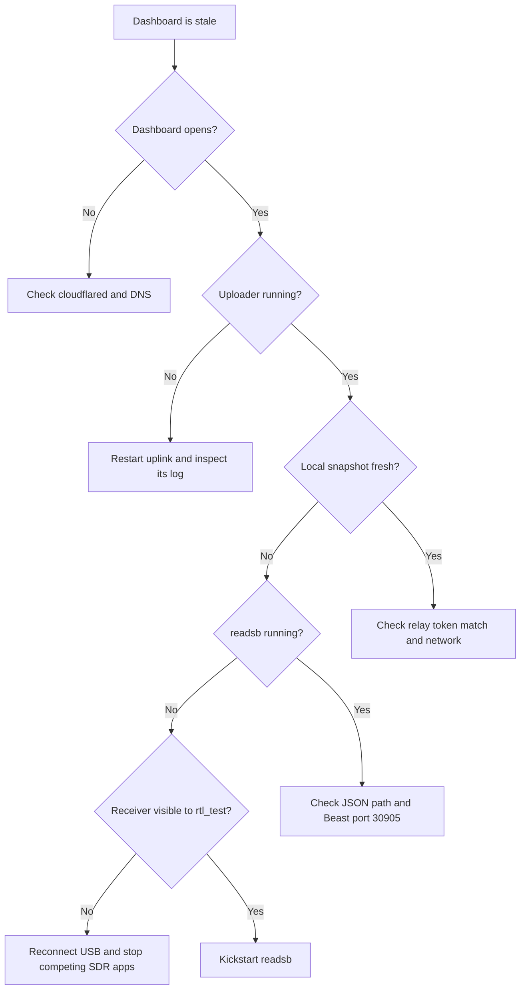

# Troubleshooting

## Fast diagnosis



## No aircraft appear

1. Extend the metal antenna and keep it vertical.
2. Move it near a window with open sky.
3. Confirm readsb owns the receiver and its JSON files are changing.
4. Check local time and the current amount of air traffic.
5. Inspect mean signal, noise, message rate, and samples lost together.

A small indoor antenna can show nearby aircraft without seeing distant traffic. Range depends strongly on line of sight and surrounding buildings.

## Device busy or no supported devices

Another program owns the USB tuner. Stop `rtl_test`, dump1090, Skyglow, SDR++, or another readsb instance. Then restart the production service:

```bash
launchctl kickstart -k "gui/$(id -u)/local.airplanes-live.readsb"
```

If needed, unplug the SDR for ten seconds, reconnect it, and check `rtl_test -s 2400000` before loading readsb again.

## Feed stopped after locking the Mac

Check the keep-awake job and AC power:

```bash
launchctl print "gui/$(id -u)/local.antenna-observatory.keepawake" \
  | grep -E 'state =|pid =|last exit code'
pmset -g assertions | grep -A4 -i caffeinate
```

The screen may lock and turn off. The Mac itself must remain awake, logged in, connected to the network, and attached to power for `caffeinate -s` to prevent system sleep.

## Dashboard opens but telemetry is stale

Readsb may still be feeding airplanes.live while the observatory path is broken. Check in this order:

1. local collector snapshot at `http://127.0.0.1:8787`;
2. `local.antenna-observatory.uplink` LaunchAgent;
3. uploader log for HTTP 401, DNS, TLS, or timeout errors;
4. remote relay log for rejected or stale ingests.

An HTTP 401 from `/api/ingest` means the Mac and relay token files do not match. Replace them through a protected channel; never paste the token into a repository or issue.

An HTTP 404 from the decoded-frame uploader after moving the dashboard to the VPS usually means the obsolete Mac Cloudflare Tunnel LaunchAgent is still loaded. The Mac and VPS then act as connectors for the same hostname, and a Beast upload can reach the local collector instead of the relay. Run the current local installer to retire `local.antenna-observatory.tunnel`; only the VPS tunnel should serve the public hostname.

## Public domain does not open

Check DNS resolution, Cloudflare Tunnel status, the Linux tunnel supervisor, and local relay readiness. The application should remain bound to loopback; do not expose port 8787 publicly as a workaround.

## A legacy bookmark opens `/login`

The compatibility route redirects to the public dashboard. If an older page appears, clear Safari’s cached website data for the domain and reload `https://antenna.ramideltoro.com/`.

## Signal seems too strong

If more than about 10% of accepted messages exceed −3 dBFS, strong nearby transmissions may overload the tuner. Compare aircraft count and valid message rate while testing a lower fixed gain. Automatic gain is the safe default for the installed setup.

## Charts have gaps

Gaps are intentional when data is stale, a history bucket includes missing telemetry, or consecutive samples are more than 30 seconds apart. The interface does not interpolate across a receiver outage.
