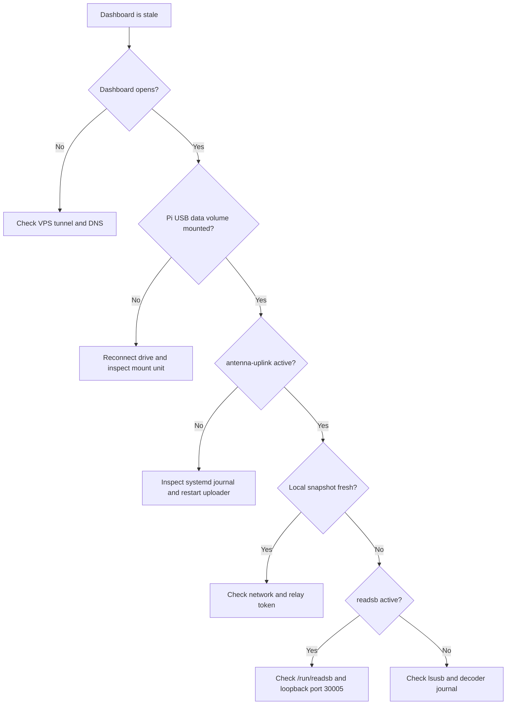

# Troubleshooting

## Fast diagnosis



## No aircraft or receiver missing

Check on the Pi:

```sh
lsusb
systemctl status readsb --no-pager
journalctl -u readsb -n 40 --no-pager
```

`No supported devices found` can mean the radio is physically disconnected. Firmly reconnect it or try another Pi USB port. `Device busy` can mean another SDR application owns the tuner; stop that competing program before restarting `readsb`. Do not run `rtl_test` while readsb owns the radio.

Keep the antenna vertical near a window or open sky. Reception depends on surrounding buildings, antenna placement and current traffic. Inspect message rate, signal/noise and lost samples together.

## USB storage missing after startup

```sh
lsblk -o NAME,SIZE,FSTYPE,LABEL,UUID,MOUNTPOINTS
findmnt /mnt/antenna-storage
systemctl status antenna-observatory antenna-frames readsb --no-pager
```

The required data volume is `ANTENNA_DATA`, an ext4 partition mounted by UUID. Reconnect it and check that `/etc/fstab` uses its current UUID. Mount it before restarting dependent services. Do not remove mount requirements to force startup onto the small system card, and do not format a drive merely because its mount failed.

## Portal opens but telemetry is stale

Check, in order:

1. Pi power, network and data-volume mount.
2. `readsb` and the changing JSON files in `/run/readsb`.
3. The collector snapshot at `http://127.0.0.1:8787/api/snapshot`, requested on the Pi.
4. `antenna-uplink` and its journal.
5. The VPS relay and tunnel logs.

```sh
curl -fsS http://127.0.0.1:8787/api/snapshot
journalctl -u antenna-observatory -u antenna-uplink -n 40 --no-pager
sudo systemctl restart antenna-uplink
```

An HTTP 401 indicates a relay credential mismatch. Restore the matching token through a private channel; never paste it into an issue. DNS, TLS and timeout errors indicate transport problems. The uploader retries automatically.

Only the VPS tunnel should serve the public hostname. An obsolete Mac tunnel can route ingest to the wrong service and cause HTTP 404 responses. The Mac receiver and uploader jobs are intentionally disabled after migration.

## Frame uploads lag or show gaps

Inspect `antenna-frames`, the Feed view, and free space on `/var/lib/antenna-observatory`. Captures rotate every two minutes, so the latest upload is not expected to update every second. Finished batches are validated and removed locally only after a matching acknowledgement.

A network outage queues data on USB. Below the 2 GiB reserve, oldest unacknowledged files are dropped and counted as gaps. Invalid older batches are quarantined. Investigate failures before deleting a backlog. The remote relay separately reports pending and failed processing batches.

## MLAT is configured but has no results

Configured means the MLAT service is enabled; it does not prove current synchronization. Inspect the service's peer and receiver statistics:

```sh
journalctl -u airplanes-mlat -n 40 --no-pager
```

MLAT needs shared aircraft observations with other receivers and an accurate antenna location. Few aircraft can mean few peers or results. The installed antenna coordinates and elevation are estimates; check those before treating low synchronization as a software fault.

## Private station edits are unavailable

The public portal intentionally disallows station changes. Use the SSH tunnel in the [operations runbook](operations.md) and open the forwarded loopback dashboard. Maintenance entries synchronize through the protected telemetry uploader.

## Public domain does not open

Check DNS, the VPS Cloudflare Tunnel, the relay supervisor and its local health endpoint. Do not expose port 8787 publicly as a workaround.

## Signal strength and chart gaps

If more than roughly 10% of accepted messages exceed −3 dBFS, compare reception while testing a lower fixed gain. Automatic gain is the installed default. Charts intentionally show gaps for stale data or long sample interruptions; they do not invent observations during outages.

## Legacy Mac troubleshooting

Mac sleep, login and Homebrew issues apply only to the [legacy setup](mac-setup.md). The active Pi pipeline should keep working when the Mac is off. A legacy `/login` bookmark redirects to the public dashboard.
